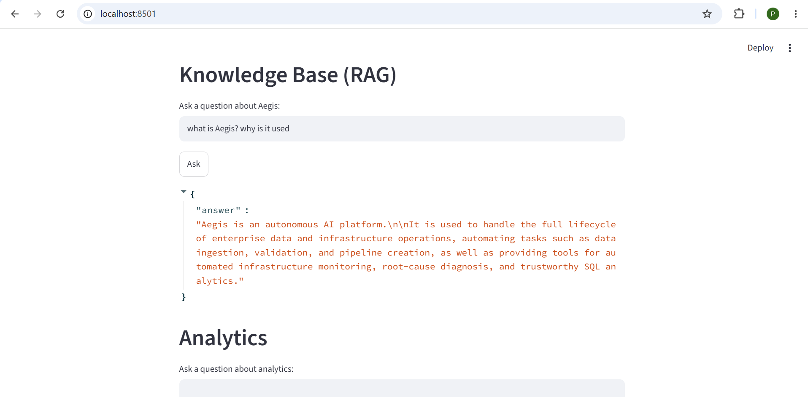
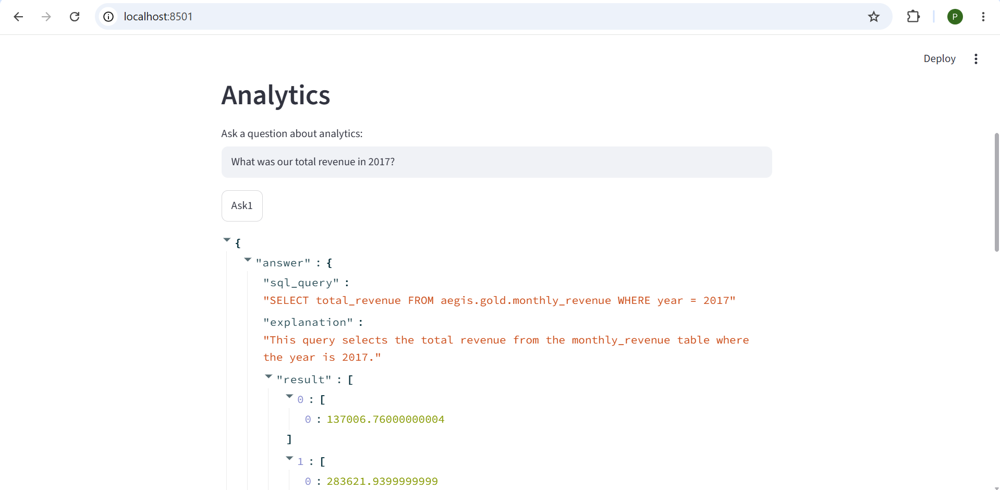
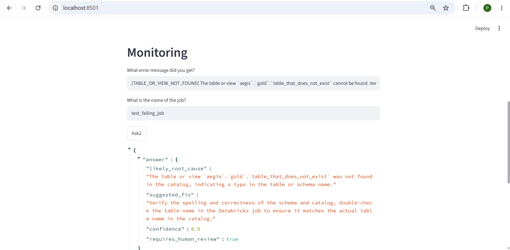
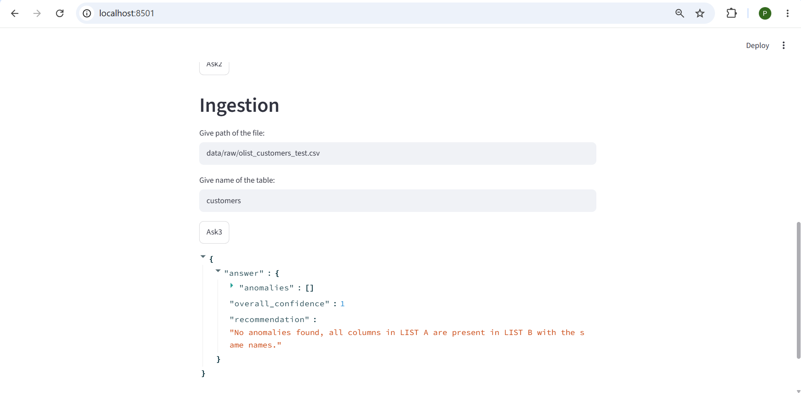

# **Aegis — Autonomous Enterprise AI Platform**
 
Aegis is an autonomous enterprise AI platform where specialized agents collaboratively manage the lifecycle of enterprise data, knowledge, infrastructure, and AI operations — ingesting data, validating quality, building Bronze/Silver/Gold pipelines, answering questions from internal docs, generating SQL analytics, and diagnosing infrastructure failures, all with a human reviewing every consequential decision.
 
Built entirely on free, local tooling — Databricks Free Edition, Ollama running locally on CPU, and a local Kubernetes cluster — as a deliberate constraint, not a limitation. That constraint is also where most of the real engineering in this project came from.
 
---
 
## Why this project exists
 
Enterprise data engineering today relies on manually-written, rule-based pipelines that break silently whenever reality drifts from what the author anticipated — a renamed column, a changed type, an unexpected null. A human has to notice, investigate, and patch code by hand, which doesn't scale.
 
Aegis replaces the *judgment-requiring* parts of that workflow (schema matching, quality assessment, failure diagnosis) with specialized AI agents that reason over novel situations and explain their decisions — while keeping the deterministic, repeatable parts (data movement, SQL execution, Delta writes) as regular, boring, reliable code. Agents propose; humans approve.
 
Full architecture writeup, including Vision, Problem Statement, and Requirements: [`docs/architecture.md`](docs/architecture.md).
 
---
 
## What it does
 
| Agent | What it does | Built on |
|---|---|---|
| **Ingestion Agent** | Compares a new file's schema against a known table's schema, flags likely renames/anomalies with an explanation and confidence score | Ollama (structured output) + pandas |
| **RAG (Knowledge) Agent** | Answers natural-language questions from internal docs, grounded only in retrieved context — refuses to answer if the context doesn't contain it | Ollama embeddings (`nomic-embed-text`) + FAISS |
| **Analytics Agent** | Converts a natural-language question into SQL, runs it against real Gold-layer tables, returns results + an explanation | Ollama (structured SQL generation) + Databricks SQL Warehouse |
| **Monitoring / RCA Agent** | Fetches real Databricks job failure data and proposes a root cause and fix | Databricks Jobs API (`databricks-sdk`) + Ollama |
 
All four agents follow the same internal contract: deterministic **tool functions** gather real facts → a **prompt builder** turns them into a prompt → an **LLM call constrained to a Pydantic schema** returns structured output → a human reviews before anything is applied.
 
---
 
## Architecture
 
```
Data Sources → Ingestion Agent → Bronze (Delta)
                                → Silver (Delta, validated)
                                → Gold (Delta, analytics-ready)
                                        ↓
        ┌───────────────┬───────────────┼────────────────────────┐
   RAG Agent       Analytics Agent   Monitoring Agent   (Unity Catalog governs all)
   (FAISS)         (SQL Warehouse)   (Jobs API)                  
        └───────────────┴───────────────┴────────────────────────┘
                        FastAPI (agent orchestration layer)
                        Streamlit (human review UI)
                        
```
 
**Data layer:** Databricks Free Edition, Unity Catalog, Delta Lake, Bronze/Silver/Gold medallion architecture (Olist Brazilian e-commerce dataset — 9 source tables).
 
**Agent layer:** Python, Ollama (`llama3.2` for generation, `nomic-embed-text` for embeddings), Pydantic for structured I/O, FAISS for vector search.
 
**Interface layer:** FastAPI (orchestration + REST API), Streamlit (human-in-the-loop review UI).
 
**Infra layer:** Docker, Kubernetes (local, via Docker Desktop), Terraform, GitHub Actions.
 
---
 
## Tech stack
 
`Python` · `Databricks` (Unity Catalog, Delta Lake, SQL Warehouses, Jobs API) · `PySpark` · `Ollama` (local CPU inference) · `FAISS` · `Pydantic` · `FastAPI` · `Streamlit` ·  `pandas`
 
---
 
## Project structure
 
```
Aegis-AI-Platform/
├── agents/            # Ingestion, RAG, Analytics, Monitoring/RCA agents
├── api/                # FastAPI orchestration layer
├── ui/                 # Streamlit human-review UI
├── pipelines/           # Bronze/Silver/Gold logic (Databricks notebooks)
├── infra/               # Docker, Kubernetes manifests, Terraform
├── observability/        # Prometheus/Grafana configs
├── docs/                # Architecture doc, known limitations
├── tests/
├── data/raw/             # Local raw source files (gitignored)
├── requirements.txt
└── README.md
```
 
---
 
## Running it locally
 
**Prerequisites:** Python 3.10+, Docker Desktop (with Kubernetes enabled), [Ollama](https://ollama.com), a Databricks Free Edition workspace.
 
```powershell
# 1. Install dependencies
pip install -r requirements.txt
 
# 2. Pull local models
ollama pull llama3.2
ollama pull nomic-embed-text
 
# 3. Configure Databricks credentials
# create a .env file (see .env.example) with:
#   DATABRICKS_SERVER_HOSTNAME=...
#   DATABRICKS_HTTP_PATH=...
#   DATABRICKS_TOKEN=...
 
# 4. Run the API
uvicorn api.main:app --reload
 
# 5. In a second terminal, run the UI
streamlit run ui/app.py
```
 
Open `http://localhost:8501` for the UI, or `http://localhost:8000/docs` for the interactive API reference.
 
---
 
## Design decisions worth knowing about
 
- **Local-first, zero paid APIs, no GPU.** A deliberate constraint that forced real engineering around an unreliable, CPU-bound local model — not a limitation glossed over. See "Known limitations" below.
- **Deterministic code for anything exact; LLMs only for genuine judgment calls.** Schema comparison, SQL safety checks, and join logic are plain Python — the LLM is reserved for fuzzy judgment (is this rename plausible, what's the likely root cause).
- **Agent-reported confidence is not trusted as a safeguard.** Empirically, both the Ingestion Agent and the Monitoring Agent produced confident-sounding, incorrect output while self-reporting low risk. Human review is a system-enforced rule, independent of what the agent claims about itself.
- **Structured output via schema-constrained generation, not prompt-only instructions.** Every agent uses Ollama's native `format` parameter with a Pydantic JSON schema, which constrains the model's output space at decode time — meaningfully more reliable than asking for "JSON only" in plain text.
---
 
## Known limitations
 
Documented honestly, not hidden — these directly informed the human-in-the-loop design:
 
- **Ingestion Agent schema comparison is unreliable.** Across repeated tests, the local 3B model hallucinated anomalies on completely clean files, even after prompt iteration. Root cause: asking an LLM to do exact list comparison via natural language is the wrong tool for that sub-task. Planned fix: move exact comparison to deterministic Python; reserve the LLM for rename judgment only.
- **API error handling is incomplete.** A missing file currently causes an unhandled exception and a raw 500 error rather than a clean JSON error response. Scoped fix identified, not yet applied to all endpoints.
- **RAG chunking is naive** (blank-line based). A real retrieval-quality bug was found and fixed by increasing `k`, but header-based chunking would produce more semantically coherent chunks.
- **SQL safety guardrail is syntax-level only.** It allowlists `SELECT`-only queries with no chained statements, but does not restrict which tables/columns can be referenced, nor estimate query cost.
- **No public deployment.** The architecture depends on local Ollama and Databricks Free Edition, neither meant to run behind a public endpoint cheaply. See `docs/architecture.md` for how each component maps to a cloud deployment (AWS/Azure) if needed.
Full write-ups: [`docs/architecture.md`](docs/architecture.md), "Known Limitations" section.
 
---
 
## Roadmap
 
- [x] Phase 0 — Scaffolding & architecture docs
- [x] Phase 1 — Bronze/Silver/Gold pipeline (Databricks)
- [x] Phase 2 — Ingestion Agent
- [x] Phase 3 — RAG Agent
- [x] Phase 4 — Analytics Agent
- [x] Phase 5 — Monitoring/RCA Agent
- [x] Phase 6 — FastAPI orchestration + Streamlit UI
- [ ] Phase 7 — Docker, Kubernetes, Terraform, GitHub Actions (in progress)
---
 
## Demo

**Knowledge Base (RAG) — grounded answer from the project's own architecture doc**


**Analytics Agent — natural language → SQL → real Databricks results**


**Monitoring/RCA Agent — real job failure diagnosed via the Databricks Jobs API**


**Ingestion Agent — schema comparison, including a caught false positive**

> Note: this run shows the agent flagging a false anomaly on an unmodified file — 
> a real, documented limitation (see [Known Limitations](docs/architecture.md)) 
> that's exactly why every agent output requires human review before being applied.
---
 
## License
 
MIT